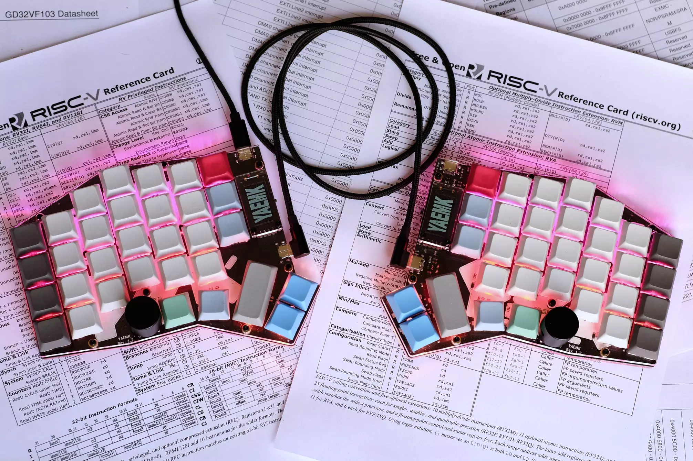
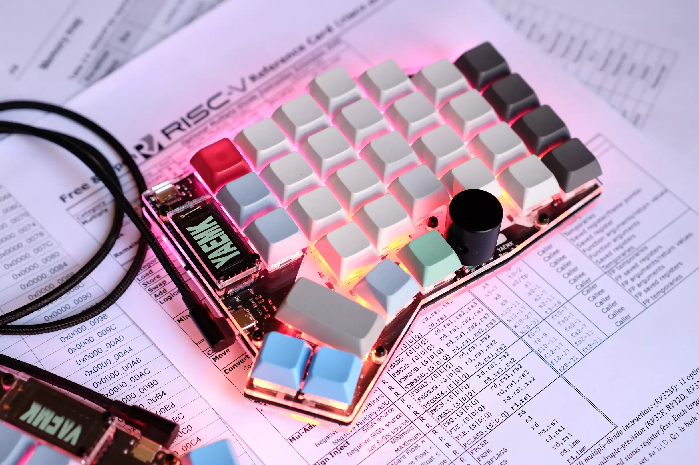
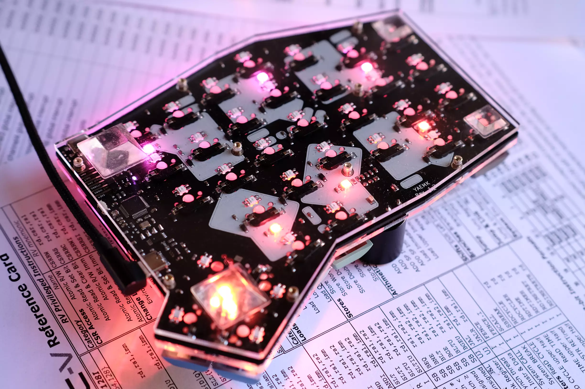

## Features

* On-board ARM microcontroller (STM32F303CCT6) or RISC-V microcontroller (GD32VF103CBT6)
* Supported by QMK Firmware
* Hotswapable 64-66 x 1u Keys
* Configureable thumb-cluster (4x1u, 2x2u, 2u+2x1u or 2x1u+2u)
* Per-Key RGB backlighting with SK6812-mini-e LEDs
* RGB underglow with SK6812-mini LEDs
* USB-C sockets for USB and split comms
* 0.96" OLED display (I2C SSD1107 64x128 Pixel)
* 2 x rotary encoders
* 64KB I2C EEPROM for settings, keymaps etc.
* Single PCB design for both sides
* Mostly 0603 SMD components
* Extra slim design, no component is taller than 2mm
* 2-plate acrylic case available

## Build Guide

## Interactive BOM

You can find the Bill of Materials and component placement in this [Interactiv html BOM](./yaemk_rev_1_2.html).

### The easy way - Order Board from JLCPCB with PCBA

Order the board nearly completely assembled from JLCPCB, solder a few missing components.

#### Additional BOM for one Board

| Amount | Part                          | LCSC    | Link                                                                                                                                                                                                                                |
| ------ | ----------------------------- | ------- | ----------------------------------------------------------------------------------------------------------------------------------------------------------------------------------------------------------------------------------- |
| 4      | USB-C Socket Mid-mount        | C168688 | [LCSC](https://lcsc.com/product-detail/USB-Connectors_Jing-Extension-of-the-Electronic-Co-C168688_C168688.html) or [Aliexpress](https://www.aliexpress.com/item/4000074094558.html)                                                 |
| 2      | Alps EC11 Rotary Encoder      | C370986 | [LCSC](https://lcsc.com/product-detail/Coded-Rotary-Switches_ALPS-Electric-EC11E183440C_C370986.html)                                                                                                                               |
| 66     | SK6812-mini-e (3228) RGB LEDs | -       | [Aliexpress](https://www.aliexpress.com/item/4000475685852.html)                                                                                                                                                                    |
| 14     | SK6812-mini (3535) RGB LEDs   | -       | [Aliexpress](https://www.aliexpress.com/item/33019583218.html)                                                                                                                                                                      |
| 66     | Kailh MX Sockets              | -       | [Aliexpress](https://www.aliexpress.com/item/32951252318.html)                                                                                                                                                                      |
| 2      | Encoder Knob                  | -       | [Splitkb](https://splitkb.com/collections/keyboard-parts/products/matte-aluminium-encoder-knob) or [Aliexpress](https://www.aliexpress.com/item/32893184848.html) or [Aliexpress](https://www.aliexpress.com/item/32810522800.html) |
| 2      | 0.96" SSD1107 64x128 Display  | -       | [Aliexpress](https://www.aliexpress.com/item/4000547865501.html)                                                                                                                                                                    |
| 2      | Purple 0603 Power LED         | C268294 | [LCSC](https://lcsc.com/product-detail/Light-Emitting-Diodes-LED_OptoSupply-OSK40603C1E_C268294.html)                                                                                                                               |
| 2      | Reset/DFU Switch              | C393942 | [LCSC](https://lcsc.com/product-detail/Tactile-Switches_SHOU-HAN-TS24CA_C393942.html)                                                                                                                                               |
| 2      | Display Socket                | C358718 | [LCSC](https://lcsc.com/product-detail/Pin-Header-Female-Header_MINTRON-MTF185-104SY1_C358718.html)                                                                                                                                 |
| 2      | Debug Pinheader (optional)    | C376124 | [LCSC](https://lcsc.com/product-detail/Pin-Header-Female-Header_MINTRON-MTB125-1106R1_C376124.html)                                                                                                                                 |

Tip: Buy some excess LEDs as they are heat sensitive!
####  Solder Components

* USB-C Socket
* Remove Split Hand Resistor 
* Close Solder Bridge
* Reset/DFU Switch
* Power LED
* Flash Firmware
* Test Board
* RGB LED
* Kailh Sockets
* Debug Header
* Display Socket
* Rotary Encoder
  
### The hard way

Order the board form JLCPCB, order the components from LCSC and Aliexpress. Solder everything yourself. You know what you are doing, no help here.
## 3mm acrylic case

### Additional BOM for one case

| Amount | Part                          | Link                                                             |
| ------ | ----------------------------- | ---------------------------------------------------------------- |
| 22     | M2x12mm Screws                | [Aliexpress](https://www.aliexpress.com/item/4000720099366.html) |
| 22     | M2x5mm Standoffs              | [Aliexpress](https://www.aliexpress.com/item/4000727223674.html) |
| 18     | M2x5mm Washers                | [Aliexpress](https://www.aliexpress.com/item/4000734426632.html) |
| 18     | M3x4.6x5mm Brass inserts nuts | [Aliexpress](https://www.aliexpress.com/item/4000688990203.html) |

## Firmware

YAEMK uses the *Quantum Mechanical Keyboard Firmware (qmk)*. To flash it onto your Board, follow these instructions: **WIP**
