# Features of the YAEMK

* Split-Keyboard with 5 rows by 8 columns matrix with columnar stagger. Key layout testers for print ([A4](yaemk_layout_tester_a4.pdf) and [Letter](yaemk_layout_tester_letter.pdf)) available!
* All 64 to 66 Keys are MX-compatible and hot-swapable.
* The thumb-cluster is configurable in 4 different configurations, just solder the hot-swap sockets to your needs.
  + 4x1u, 2x2u, 2u+2x1u or 2x1u+2u configuration possible.
  + Inspired by the marvelous [Kyria](https://splitkb.com/collections/keyboard-kits/products/kyria-pcb-kit) from Thomas Baart!
* On-board ARM microcontroller (STM32F303CCT6) or RISC-V microcontroller (GD32VF103CBT6)
  + **Worlds first RISC-V (Split-)Keyboard!**
* Fully Supported by QMK Firmware
  + VIA json provided!
* Per-Key RGB back lighting with 66 easy to solder SK6812-mini-e LEDs
* Underglow RGB with 14 SMD SK6812-mini LEDs
* USB-C Hot-plugable sockets for USB connection and split communication between the halves
* Two 0.96" OLED displays for comprehensive information (I2C SH1107 64x128 Pixel)
* 2 x Rotary encoders for scrolling, volume changes etc.
* On-board 64KB I2C EEPROM for settings, keymaps etc.
* Open-Source, single PCB design for both sides.
  + PCB SMT assembly files for JLCPCB in the repo!
* 2-plate acrylic case files available.

### Table of contents

* TOC
{:toc}
  
## YAEMK Key layout testers

Find out if building a YAEMK fits your hands, available in:

* [A4 Key layout tester](yaemk_layout_tester_a4.pdf)
* [Letter Key layout tester](yaemk_layout_tester_letter.pdf).

## Thumbcluster configurations

Four thumbcluster configurations are possible, depending on the location of the soldered hot swap sockets. Every configuration has a dedicated top plate for the case in the repository.

# Build Guide

**DISCLAIMER: At the time of writing (9th of April 2021) there is a world wide on-going semiconductor shortage, both MCUs of the YAEMK the [STM32F303CCT6](https://www.oemsecrets.com/compare/1/EUR/STM32F303CCT6) and [GD32VF103CBT6](https://www.oemsecrets.com/compare/1/EUR/GD32VF103CBT6) are affected of this shortage and are out of stock. The GD32VF103CBT6 can be sourced from devboards like the Sipeed Longan Nano, but desoldering requires a hot air station. Also the GD32VF103 requires setting up a [GCC RISC-V toolchain](https://github.com/riscv/riscv-gnu-toolchain) and the [ChibiOS port](https://github.com/ChibiOS/ChibiOS-Contrib/pull/266) that is needed for QMK support is bleeding edge and possibly has some undetected bugs! Use at your own risk.**

The complete design including [schematics](https://github.com/KarlK90/yaemk-split-kb/tree/main/PCB), [gerbers](https://github.com/KarlK90/yaemk-split-kb/tree/main/PCB/gerbers), [pcb smt assembly files](https://github.com/KarlK90/yaemk-split-kb/tree/main/PCB/assembly) and a [acrylic plate case](https://github.com/KarlK90/yaemk-split-kb/tree/main/Case) are open source and available in the repository. The complete project can be opened with the open source [KiCad EDA](https://www.kicad.org/).

> **If you have never soldered before the YAEMK will be quite a challenge, therefore it is recommended to buy yourself some SMD soldering practice kits and learn it beforehand.**

## 1 The Boards

Building your own YAEMK involves ordering the pcbs from [JLCPCB](https://jlcpcb.com/) with pcb smt assembly, so nearly all components come pre-soldered. Only through hole components, tactile-switches, connectors and smd components have to be soldered by you. It is crucial to understand that the YAEMK pcb is flip able, which means that every circuit board can be turned once into the left or right side of your keyboard. Depending on right or left handedness of the pcb these components have to be soldered either on the front or back side of the pcb. The whole process is documented in detail below. The tools you will need are a good quality pair of tweezers, flux, leaded solder and a temperature controlled soldering iron, a hot air station is recommended but not strictly necessary. For easy component location and sourcing of parts it is recommended to use the [interactiv HTML BOM](./yaemk_rev_1_2.html).

<iframe src="./yaemk_rev_1_2.html" width="100%" height="500px"></iframe>

### Ordering process

If you have never ordered PCBs with assembly from [JLCPCB](https://jlcpcb.com) I highly recommend watching the steps from Phil’s Lab in the [KiCad STM32 + USB + Buck Converter PCB Design and JLCPCB Assembly](https://www.youtube.com/watch?v=C7-8nUU6e3E&t=9872s) video. The default settings are mostly fine the changes you want to pick are the following:

#### PCB

* 2 Layers (The video has a 4 Layer board)
* PCB Oty: As much as you like
* PCB Color: Black
* No impedance control (Option only shown in the video) 
* Surface Finish: HASL(with lead) if you want the easiest soldering experience or LeadFree HASL. For extra bling-bling choose ENIG gold finish.
* Remove Order Number: Yes

#### SMT Assembly

**ATTENTION: At the time of writing (9th of april 2021) there is a world wide on-going semiconductor shortage, both MCUs of the YAEMK the [STM32F303CCT6](https://www.oemsecrets.com/compare/1/EUR/STM32F303CCT6) and [GD32VF103CBT6](https://www.oemsecrets.com/compare/1/EUR/GD32VF103CBT6) are affected of this shortage and are out of stock. Therefore you currently can not order the pcb with the MCU pre-soldered. I was not able to correct and confirm the MCU orientation, it is likely rotated in correctly. As soon as the MCU is in stock again this will be addressed.**

* Assemble top side
* SMT Oty: As much as you like
* Tooling holes: Added by Customer
* Add BOM file: the file is [PCB/assembly/YAEMK_bom.csv](https://github.com/KarlK90/yaemk-split-kb/blob/main/PCB/assembly/YAEMK_bom.csv)
* Add CPL file: the file is [PCB/assembly/YAEMK-top-poc_corrected.csv](https://github.com/KarlK90/yaemk-split-kb/blob/main/PCB/assembly/YAEMK-top-pos_corrected.csv)
* If you want the GD32VF103 MCU, deselect `U5 STM32F303CCTx` on the Select Parts page. You have to source and solder the GD32VF103 yourself.

After placing your order you can proceed ordering the missing parts from [LCSC](https://lcsc.com/), as they are both part of the same company, you [can save shipping costs](https://easyeda.com/forum/topic/How-to-combine-boards-JLCPCB-and-components-LCSC-into-a-common-order-cc0f3ff5fc0845839af9f37910bca742) when specifying your JLCPCB order number.

### Additional bill of materials for one complete Keyboard

All components that are NOT pre-soldered by [JLCPCB](https://jlcpcb.com/) are listed in this table and have to be bought and assembled by you. Switches and Keycaps are highly personal decision, you find my recommendation at the bottom. As I'm using a rather uncommon keyboard layout (K.O,Y) I stick to blank keycaps.

| Amount | Part                                   | LCSC    | Link                                                                                                                                                                                                                                                                 |
| ------ | -------------------------------------- | ------- | -------------------------------------------------------------------------------------------------------------------------------------------------------------------------------------------------------------------------------------------------------------------- |
| 4      | USB-C Socket Mid-mount                 | C168688 | [LCSC](https://lcsc.com/product-detail/USB-Connectors_Jing-Extension-of-the-Electronic-Co-C168688_C168688.html) or [Aliexpress](https://www.aliexpress.com/item/4000074094558.html)                                                                                  |
| 2      | Alps EC11 Rotary Encoder               | C370986 | [LCSC](https://lcsc.com/product-detail/Coded-Rotary-Switches_ALPS-Electric-EC11E183440C_C370986.html)                                                                                                                                                                |
| 66     | SK6812-mini-e (3228) RGB LEDs          | -       | [Aliexpress](https://www.aliexpress.com/item/4000475685852.html)                                                                                                                                                                                                     |
| 14     | SK6812-mini (3535) RGB LEDs            | -       | [Aliexpress](https://www.aliexpress.com/item/33019583218.html)                                                                                                                                                                                                       |
| 66     | Hotswap Kailh or Gateron Sockets       | -       | [Aliexpress](https://www.aliexpress.com/item/32951252318.html) or [Aliexpress](https://www.aliexpress.com/item/1005002037689483.html)                                                                                                                                |
| 2      | Encoder Knob                           | -       | [Splitkb](https://splitkb.com/collections/keyboard-parts/products/matte-aluminium-encoder-knob) or [Aliexpress](https://www.aliexpress.com/item/32893184848.html) or [Aliexpress](https://www.aliexpress.com/item/32810522800.html)                                  |
| 2      | 0.96" SSD1107 64x128 Display           | -       | [Aliexpress](https://www.aliexpress.com/item/4000547865501.html)                                                                                                                                                                                                     |
| 2      | Purple 0603 Power LED                  | C268294 | [LCSC](https://lcsc.com/product-detail/Light-Emitting-Diodes-LED_OptoSupply-OSK40603C1E_C268294.html)                                                                                                                                                                |
| 2      | Reset/DFU Switch                       | C393942 | [LCSC](https://lcsc.com/product-detail/Tactile-Switches_SHOU-HAN-TS24CA_C393942.html)                                                                                                                                                                                |
| 2      | Display Socket                         | C358718 | [LCSC](https://lcsc.com/product-detail/Pin-Header-Female-Header_MINTRON-MTF185-104SY1_C358718.html)                                                                                                                                                                  |
| 2      | Debug Pinheader (optional)             | C376124 | [LCSC](https://lcsc.com/product-detail/Pin-Header-Female-Header_MINTRON-MTB125-1106R1_C376124.html)                                                                                                                                                                  |
| 66     | Switches (depending on Thumbcluster)   | -       | Personal recommendations [Clicky - Box Yellow](https://www.aliexpress.com/item/1005001684056035.html) or [Tactile - Boba U4 RGB](https://www.aliexpress.com/item/1005001809357064.html) or [Linear - Boba Bobbagum](https://www.aliexpress.com/item/1005001985634467.html) |
| 64-66  | 1u Keycaps (depending on Thumbcluster) | -       | Personal recommendation [1u XDAS Profil](https://www.aliexpress.com/item/33047653096.html)                                                                                                                                                                           |
| 0-4    | 2u Keycaps (depending on Thumbcluster) | -       | [2u XDA Profile](https://www.aliexpress.com/item/1005001376888502.html)                                                                                                                                                                                                                                                                     |

**Tip: Buy some excess LEDs as they are heat sensitive!**

### Placement of hotswap sockets for thumbcluster

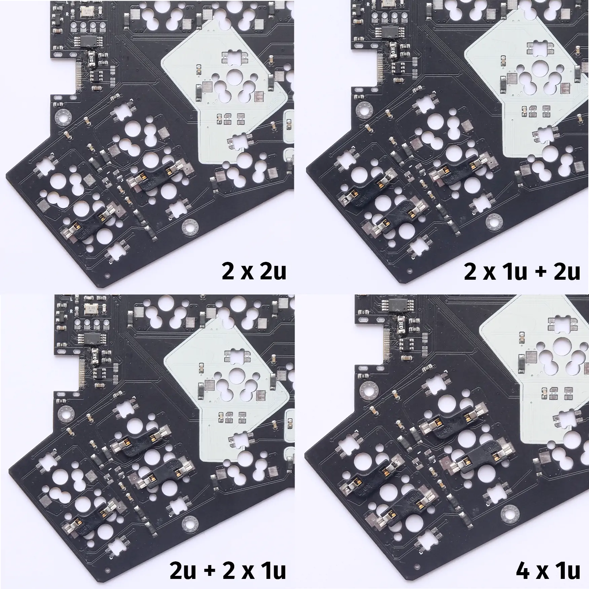

### Correct orientation of hotswap sockets

Do not obstruct the middle hole with the hotswap sockets or switches will not fit!

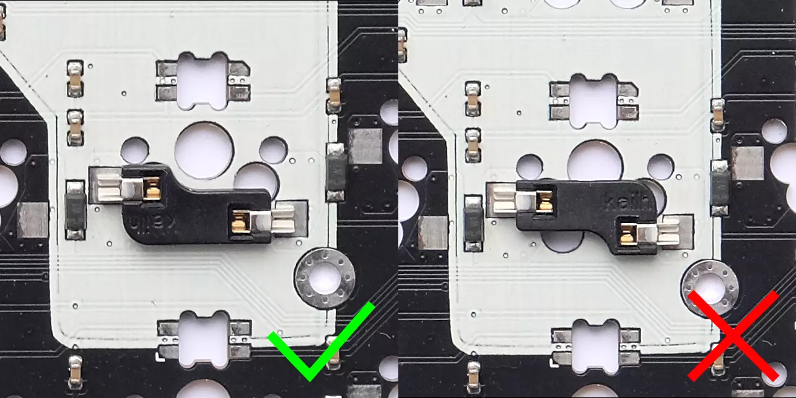

### Correct orientation of rgb leds

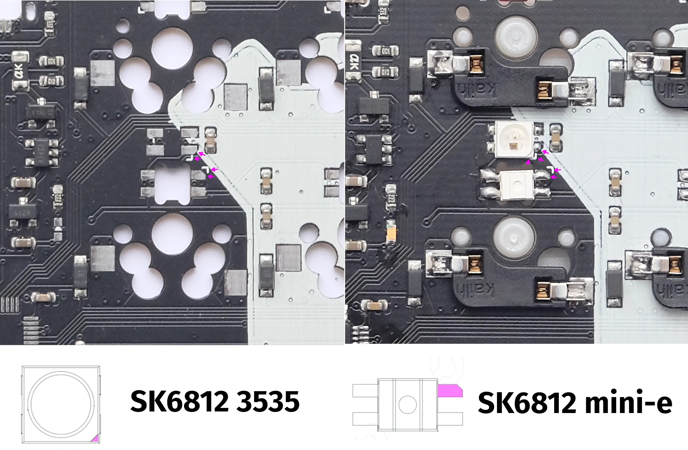

Every led has little chamfer that indicates the correct orientation, match it with the chamfer on the pad of the pcb and the little white triangle silk screened next to the pad. Two types of leds are used on the YAEMK the first sk6812 3535 are for underglow, there are 7 per side in total and distributed along the edges of the pcb, it is the upper led in the picture. They shine down on the surface the keyboard rests on. The second type are sk6812-mini-e leds for per-key backlighting, it is the lower led in the picture. They shine up through the pcb, away from the surface the keyboard rests on.

### Step-by-step Instructions

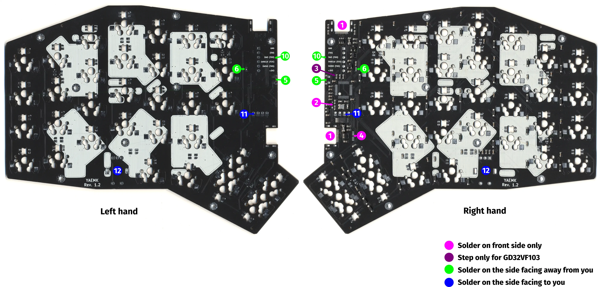

*Note: the picture shows pcbs without an mcu.*

> Emphasized text like `P1 and P2` are the component references, you can find them in the schematic and interactive bom. 

1. Solder USB-C Sockets for USB connection and Split communications. `P1 and P2`
  * Make sure to apply enough solder and thoroughly wet the pins that secure the socket with the pcb.
2. Remove handedness selection resistor `R24 or R25`
  * The handedness, meaning if it is the right or left side of the keyboard, is determined by these resistors. PCBs come with both resistors soldered in place from JLCPCB. Keep the resistor for the side you want this PCB to be, e.g. keep resistor `R25` next to the little R if this PCB should be the right side of the keyboard and remove resistor `R24` next to the little L.
3. *(GD32VF103 only)* Remove USB D+ pullup resistor `R20`
4. Close split communication solder jumpers `JP1 and JP2`
  * Both halves of the YAEMK communicate via a full-duplex USART connection over a USB-C cable (we re-purpose the USB cable for this). For this to work the TX lines of one halve have to be connected with the RX line of the other halve. That's what the solder bridge is for, to reroute the TX line of one halve into the RX line of the other.
  * Connect the left pad with the middle pad on both jumpers via a solder bridge on the left side of the keyboard.
  * Connect the right pad with the middle pad on both jumpers via a solder bridge on the right side of the keyboard.
5. Solder Reset/DFU Switch on the side facing away from you. `S32`
6. Solder power LED on the side facing away from you. `D70`
  * A little triangle shows the orientation of the LED on the board, match this triangle with the triangle on the bottom of the led.
7. Flash the firmware and test for successful usb connection.
8. Solder RGB LEDs on the side facing away from you. Make sure to [correctly orient](#correct-orientation-of-rgb-leds) them, as they are not the same orientation all the time. Use the interactive BOM when in doubt. `D35 to D76`
9. Solder MX Hotswap Sockets on the side facing away from you. Decide for a [thumbcluster configuration](#placement-of-hotswap-sockets-for-thumbcluster). Make sure to [correctly orient](#correct-orientation-of-hotswap-sockets) them. `S1 to S31`
10. *(Optional)* Solder Debug Header on the side facing away from you. `J1`
11. Solder Display Socket on the side facing to you. `P3`
  * Bridge the pads next to the through holes when soldering to close the contact.
12. Solder Rotary Encoder on the side facing to you. `SW1`
13. Clean the Board from any residues with alcohol.
14. Test board for full operation:
    * Successful USB connection of both halves to the pc, regardless of plug orientation.
    * Successful split connection of between both halves, regardless of plug orientation.
    * Key presses for all keys are registered, for testing bridge the terminals of the hotswap-sockets with a piece of wire.
    * All leds fully light up, no flickering when slightly bending the pcb.
    * Rotary encoders register motion.
    * Displays show YAEMK logo on startup on both halves.
    * Reset+DFU tactile switch resets the board on short press and enters DFU bootloader on long press (see GD32VF103 specific notes in Firmware section).
15. *(Optional)* Paint the edges of the pcb with a black marker pen.

### Finished left handed PCB for reference, switches are already installed.

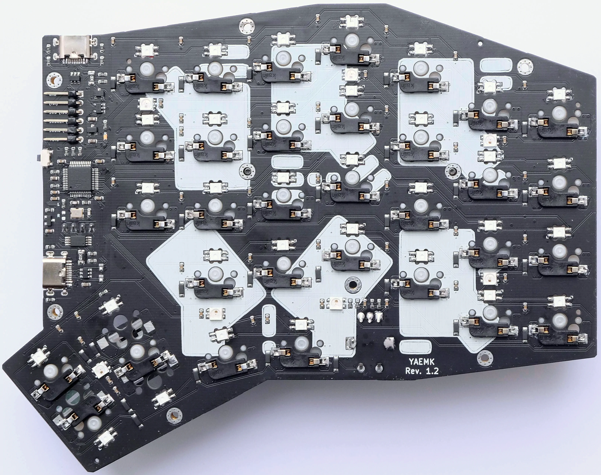

## Troubleshooting

### No USB connection 

Make sure that you soldered the pins of the USB-C sockets to the pads, if in doubt reflow with solder and flux. Test for continuity with a multimeter on the d+ and d- lines between the legs of the ESD protection diode `U3` and a plugged in USB-C cable.  

### No split communication

Make sure that you soldered the pins of the USB-C sockets to the pads, if in doubt reflow with solder and flux. Test for continuity with a multimeter on the TX and RX lines between the legs of the ESD protection diode `U4` on both halves connecting them with a USB-C cable. Make sure that you closed the solder bridges in opposite fashion on both halves i.e. the left halve bridged the left pads with solder bridges and the right halve bridged the right pads with solder bridges.

### No power

Check for shorts between VDD and GND with a multimeter. Make sure that the USB-C sockets are soldered the their pads, if in doubt reflow with solder and flux.

### LED chain broken or flickering LEDs

Check the correct orientation of the rgb led first, correct if necessary. If correct try to apply some pressure to first LED that doesn't work in the chain, if this turns on the led you have cold solder connection - reflow the led. Should that not work, try the last LED in the chain that does work properly, if that turns on other LEDs in the chain the problem was the again a cold solder connection - reflow the led. If all that doesn't help try to re-solder these leds, even if applying pressure didn't help. If that doesn't solve the problem one of the leds is dead, replace with a new one. 

## 2 Acrylic plate case

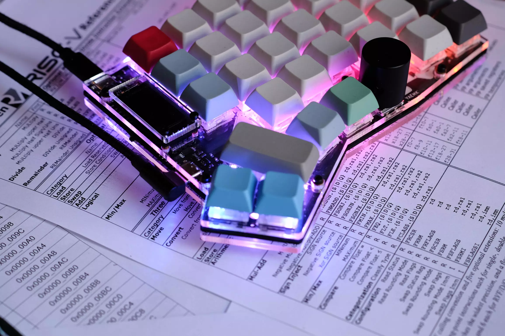

The official YAEMK case consists of one top and bottom plate and a display cover for each side and is made out of 3mm acrylic plates. All designs are flipable, so each plate can be used for the left or right side of the keyboard. For each thumbcluster configuration a specific top plate was designed, the bottom plate is universal for all configurations. You can find the [SVG files](https://github.com/KarlK90/yaemk-split-kb/tree/main/Case) in the repo once without kerf and once with a kerf of 0.1mm for laser cutting. Cast Acrylic is highly recommended for its clearer appearance and sturdiness, extruded acrylic is brittle and prone to cracks!

### Case principle

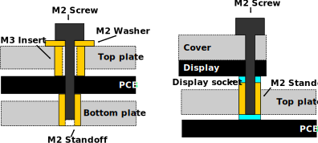

The pcb is clamped by the brass M3 insert and M2 standoff by tightening the M2 screw which only has grip in the M2 standoff. The Display is clamped between the cover and the M2 standoffs of the top case and display socket. Both brass inserts are melted flat to the surface into the acrylic plates using a soldering iron set to 160c and a pointed tip, like the T12-I. Watch this [video](
https://youtu.be/XNGXNDp0mMw?t=114) to get a understanding of the process.

### Bill of material for one case

| Amount | Part                          | Link                                                             |
| ------ | ----------------------------- | ---------------------------------------------------------------- |
| 2      | YAEMK Top plate               | ---                                                              |
| 2      | YAEMK Bottom plate            | ---                                                              |
| 2      | YAEMK Display cover           | ---                                                              |
| 8      | Transparent plastic bumpers   | ---                                                              |
| 22     | M2x12mm Screws                | [Aliexpress](https://www.aliexpress.com/item/4000720099366.html) |
| 22     | M2x5mm Standoffs              | [Aliexpress](https://www.aliexpress.com/item/4000727223674.html) |
| 18     | M2x5mm Washers                | [Aliexpress](https://www.aliexpress.com/item/4000734426632.html) |
| 18     | M3x4.6x5mm Brass insert nuts | [Aliexpress](https://www.aliexpress.com/item/4000688990203.html) |

### Step-by-step instructions

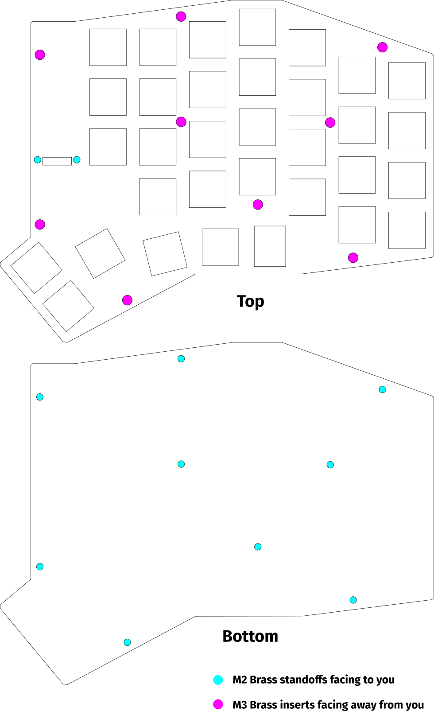

**Pay attention to make all inserts flush with the surface! If acrylic obstructs the inserts after insertion remove it while it is still warm.**

1. Melt M3 insert into the top plate.
2. Melt M2 standoffs for the display cover into the top plate.
3. Melt M2 standoffs into bottom plate.
4. (Optional) Paint the blue display frame with a black marker pen.
5. Trim the plastic and the pin header of the display so that the pcb of the display sits flush on the display socket.
6. Assemble case with display and display cover.
7. Insert switches and keycaps.

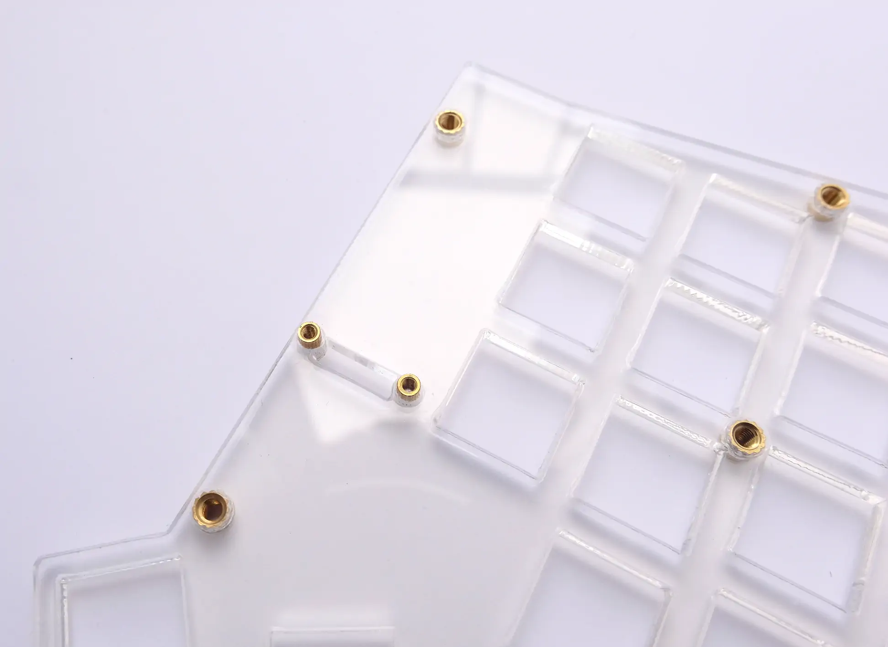

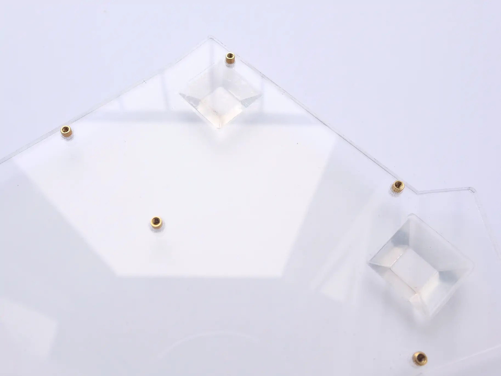

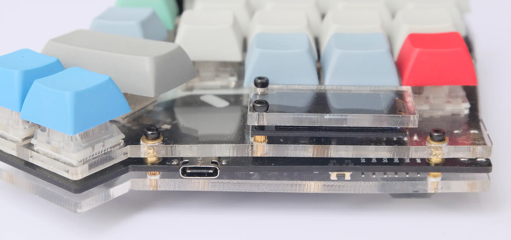
## 3 Firmware

YAEMK uses the *Quantum Mechanical Keyboard Firmware (qmk)*. At the time of writing (9th of April 2021) the YAEMK uses features which are still pending as pull requests namely:

* [Update OLED driver to support some new displays by sigprof](https://github.com/qmk/qmk_firmware/pull/10379)
* [Extensible split data sync by tzarc](https://github.com/qmk/qmk_firmware/pull/11930/)
* [Add support for RISC-V builds and GD32VF103 MCU by karlk90 (me)](https://github.com/qmk/qmk_firmware/pull/12508)
* [Add Full-duplex serial driver for ARM boards by karlk90 (me)](https://github.com/qmk/qmk_firmware/pull/9842)

Until there is mainline support for YAEMK in QMK you will have to use my QMK fork, that is kept up to date with develop as best as possible. To flash it onto your Board, follow these instructions:

1. Clone the  firmware repository.
  * `git clone -b yaemk-split-kb https://github.com/KarlK90/qmk_firmware.git && cd qmk_firmware`
2. Install the `qmk` tool. You can find detailed instructions [here](https://docs.qmk.fm/#/newbs_getting_started).
3. Put your board into the USB-DFU bootloader mode.
  * STM32F303: Hold the Reset+DFU button until your board registers as STM32 DFU bootloader
  * GD32VF103: Hold the Reset+DFU button with the USB cable detached, plug in the cable and release the button shortly after. Timing is key it could take a few tries.
4. Adjust features to your liking.
5. Flash the firmware.
  * `qmk flash -kb yaemk -km default`

### GD32VF103 GCC Toolchain

The default QMK toolchain doesn't support RISC-V GCC at the moment you have to build or install your own [`riscv64-unknown-elf` toolchain](https://github.com/riscv/riscv-gnu-toolchain) with multilib support.
