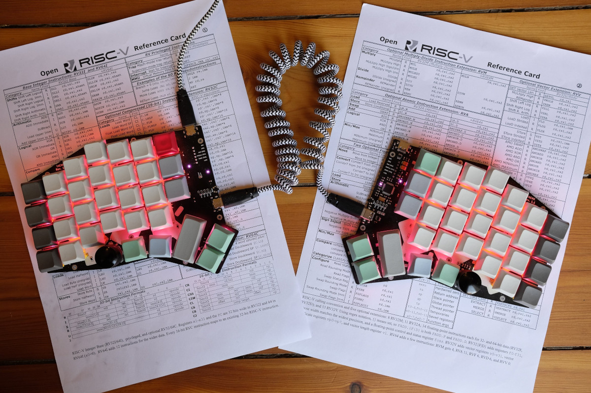

# Yet Another Ergonomic Mechanical Keyboard

Is a 8x5 staggered column split keyboard with an pronounced offset between the colums. 

## Features

* On-Board ARM Microcontrollers (STM32F103 or STM32F303)
* runs with qmk Firmware
* 64-66 x 1u Keys
* Kailh MX Hotswap Sockets
* Per-Key RGB WS2812 Backlighting, mounted in-board
* 2 x Rotary Encoders
* USB-C USB 2.0 Connection
* USB-C Sockets for Interconnection
* I2C OLED Compatible
* Single PCB for both sides
* SMD Components
* Extra slim design, no component is taller than 2mm

## Demo

<iframe width="560" height="315" src="https://www.youtube-nocookie.com/embed/-Mvi0P6VIho" frameborder="0" allow="accelerometer; autoplay; clipboard-write; encrypted-media; gyroscope; picture-in-picture" allowfullscreen></iframe>

## Build Guide

If you have never soldered SMD components before don't be afraid it is absolutly doable with the right tools and some practice. 

You can find the Bill of Materials and component placement in this [Interactiv html BOM](./ibom_rev1-1.html).

## Firmware

YAEMK uses the *Quantum Mechanical Keyboard Firmware (qmk)*. To flash it onto your Board, follow these instructions:

1. Clone the  firmware repository:

   `git clone -b yaemk https://github.com/KarlK90/qmk_firmware.git && cd qmk_firmware `

2. Install the `qmk` tool:

   You can find detailed instructions [here](https://docs.qmk.fm/#/newbs_getting_started).

3. Flash the firmware:

   `qmk flash -kb yaemk/rev1_1 -km via`